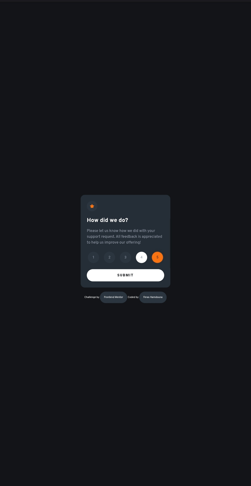
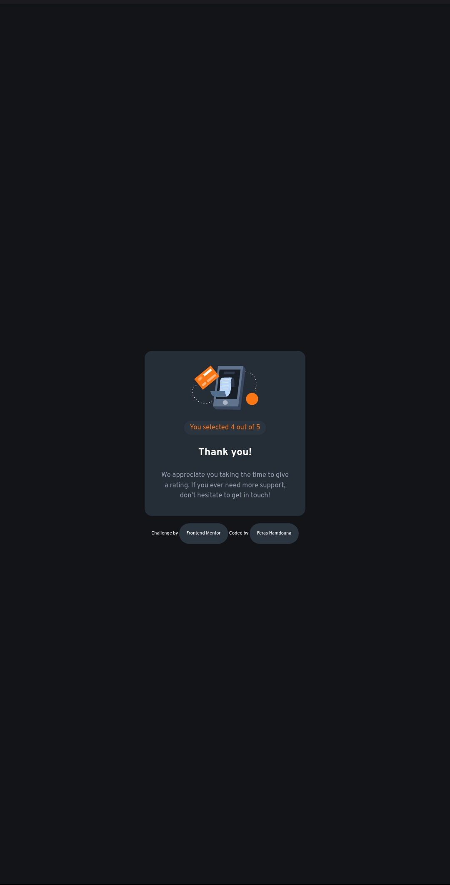
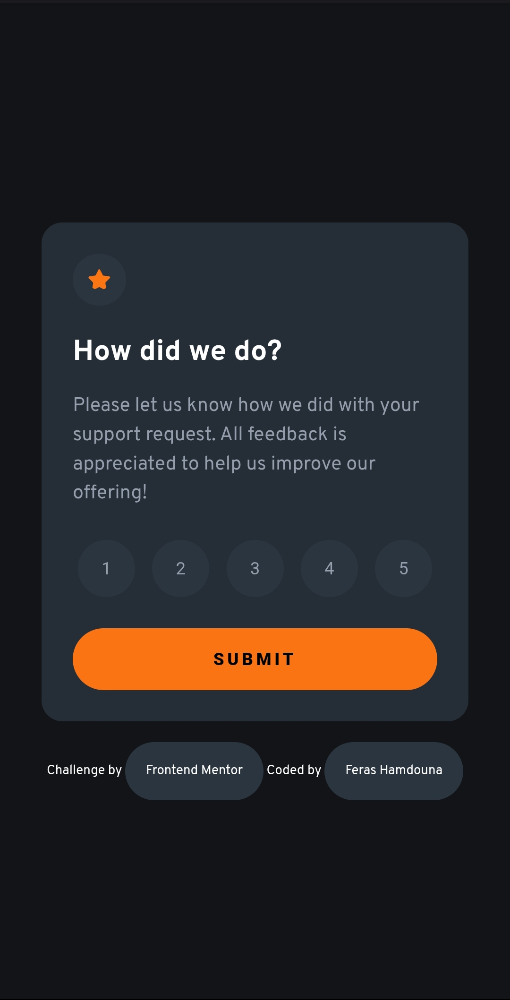
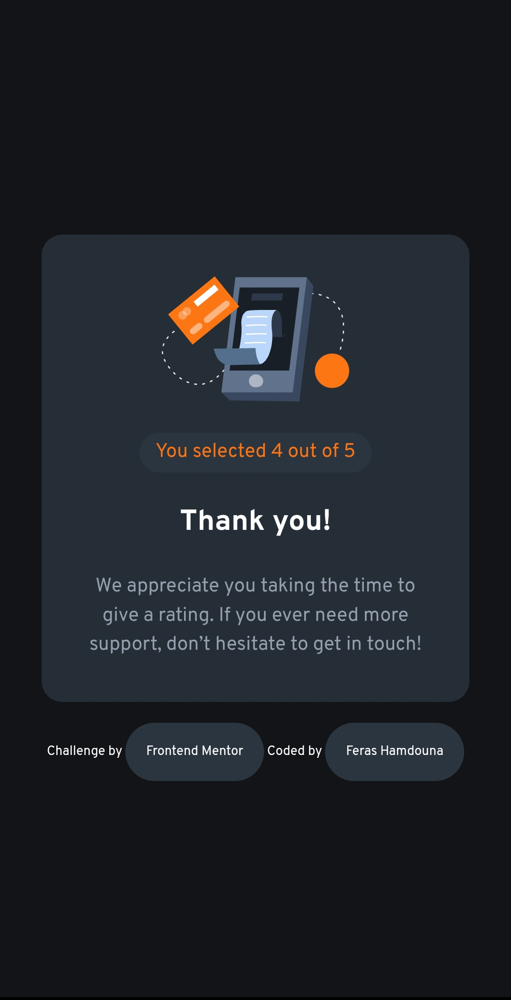

# Interactive Rating Component Solution

This is a solution to the [Interactive Rating Component challenge on Frontend Mentor](https://www.frontendmentor.io/challenges/interactive-rating-component-koxpeBUmI).

## Table of contents

- [Overview](#overview)
  - [The challenge](#the-challenge)
  - [Screenshot](#screenshot)
  - [Links](#links)
- [My process](#my-process)
  - [Built with](#built-with)
- [Author](#author)

## Overview

### The challenge

Users should be able to:

- Select a rating from 1 to 5.
- Submit their rating and see a thank-you state.
- Experience a fully interactive, responsive design.
- Enjoy clean, accessible, and semantic HTML structure.

### Screenshot

  
  
  
  
  

### Links

- Solution URL: [Frontend Mentor Solution](https://www.frontendmentor.io/solutions/interactive-rating-component-using-html-css-and-javascript-FIOj656P3n)
- Live Site URL: [Live Demo](https://ferashamdouna.github.io/interactive-rating-component/)

## My process

### Built with

- Semantic HTML5
- CSS custom properties
- Flexbox
- Responsive design (Desktop-first workflow)
- Vanilla JavaScript for interactivity

## Author

- GitHub - [@FerasHamdouna](https://github.com/FerasHamdouna)
- Frontend Mentor - [@FerasHamdouna](https://www.frontendmentor.io/profile/FerasHamdouna)
